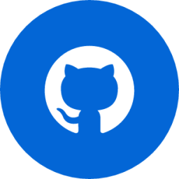

<!--  -->

  
  <h1> ¡Hola! Soy Hengers Rosario</h1>

## 💫 Sobre Mi:

Soy Técnico Electrónico y futuro Ingeniero con más de 12 años de experiencia en el campo de la electrónica y la programación. Mi enfoque principal ha sido el diseño de hardware y desarrollo de software para sistemas embebidos, asi como software para ordenadores. A lo largo de mi carrera, he adquirido habilidades en una variedad de lenguajes de programación y tecnologías. Al igual que mi pasión por el desarrollo de aplicaciónes web.

Además, soy un desarrollador Full Stack con 1 y 1/2 años de experiencia en Front-End y Back-End.

- 💼 Profesión: Ingeniero Electrónico en Formación.
- 🎓 Cursando SoyHenry: Full Stack Developer.
- 🏆 Proyecto Final en Curso: [Mitsumichi](https://github.com/edgartellom/Mitsumichi)
- 🌱 Actualmente estoy enfocado en aprender: PHP y Sanity.
- 🌐 Lenguajes de Programación: Python, Basic, Visual Basic.Net, C, C#, C++, Java, Assembler.
- 🌐 Desarrollo Web: HTML, CSS, Tailwind, JavaScript, TypeScript.
- 🌐 Frameworks Front-End: React, NextJS, VITE.
- 🌐 Frameworks Back-End: Node.js, Express.
- 🌐 Bases de Datos: SQL, Sequelize, Firebase.
- 💻 Experiencia en Desarrollo: Front-End y Full Stack
- 🚀 Experiencia en Git y Manejo de Versiones

##  Experiencia con Git

Tengo experiencia en el uso de Git y el manejo de versiones para controlar el desarrollo de software y colaborar en proyectos de equipo. Algunos aspectos destacados de mi experiencia con Git incluyen:

- Gestión eficiente de repositorios Git en proyectos de desarrollo.
- Colaboración efectiva en equipos utilizando ramas, fusiones (merges) y conflictos de fusión (merge conflicts).
- Uso de plataformas de alojamiento de código como GitHub para gestionar proyectos y colaborar con otros desarrolladores.

## 🌟 Áreas de Interés y Logros

Mis áreas de interés y logros adicionales incluyen:

- **Innovación tecnológica:** Siempre estoy buscando nuevas tecnologías y enfoques para aplicar en proyectos futuros.

- **Optimización de procesos:** Me interesa la optimización de procesos para aumentar la eficiencia en el desarrollo de software y la electrónica.

- **Desarrollo sostenible:** Estoy comprometido con la sostenibilidad y la tecnología verde.

- **Creación de Experiencias Web Impactantes:** creación de aplicaciones web interactivas y atractivas que proporcionen a los usuarios una experiencia de alta calidad.

- **Desarrollo Full Stack:** He trabajado tanto en el Front-End como en el Back-End, lo que me permite crear aplicaciones web completas y escalables. Estoy familiarizado con frameworks como React, Vite, NextJS, Node.js y Express, lo que me permite ofrecer soluciones integrales.

- **Integración de Bases de Datos:** He implementado bases de datos SQL, PostgreSQL y Firebase en proyectos web, lo que me permite gestionar datos de manera efectiva y proporcionar funcionalidades sólidas.

- **Diseño Responsivo:** Soy estoy familiarizado en el diseño y desarrollo de aplicaciones web responsivas que se adaptan a diferentes dispositivos y tamaños de pantalla, garantizando una experiencia de usuario coherente.

Estoy emocionado por continuar explorando y contribuyendo al desarrollo web, alineando mis intereses con mis habilidades y experiencia para crear soluciones web impactantes.

## 📊 Estadísticas de GitHub

Puedes ver mis estadísticas de GitHub para tener una idea de mi actividad en la plataforma

<table align="center">
<tr border="none">
<td width="50%" align="center">
  
  
    
   
</td>

<td width="50%" align="center">

  
  
  </td>
</tr>
</table>

## 💻 Habilidades

  
  
 
 

  
  

  

  
  
  

    
  
  

  

  
  

  
  
 
   
  
  

<h4>Entre otras...</h4>

## ✍️ Random Dev Quote

## 📞 Contacto

¡Me encantaría conectarme contigo! Puedes encontrarme en las siguientes redes y sitios web:

- 📧 Correo electrónico: hengersrosario.m@gmail.com
- 💼 LinkedIn: [Sígueme en Linkedin](www.linkedin.com/in/hengers-rosario-05a169275)
- 🐦 Twitter: [Sígueme en Twitter](https://twitter.com/Hengers_Rosario)

¡Gracias por visitar mi perfil de GitHub! Si tienes alguna pregunta, deseas colaborar en un proyecto o simplemente quieres charlar sobre tecnología, ¡no dudes en contactarme!
